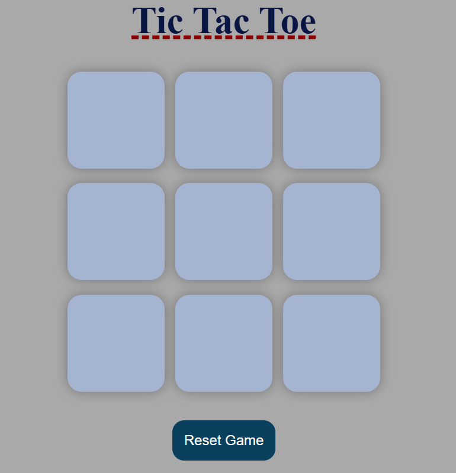

# Simple Tic-Tac-Toe Game using JavaScript

I have created a simple **Tic-Tac-Toe Game** using JavaScript. It is a basic Tic-Tac-Toe game using HTML, CSS and Javascript.
We all know that a Tic-Tac-Toe game contains 9 boxes in a 3*3 matix and their will be two players, one will have a **O** symbol and other will have **X** symbol. Each player will get alternate chances or we can call turn.

# How to get started

1. To mark the symbol, player has to click on the box in which they want to mark their symbol. In this there is no provision to undo a mark/move. Once the mark is made, the game proceeds to the next player's turn.
2. We are having winning patterns (index of the boxes are considered) to decide the winner and they are:
    * 0, 1, 2
    * 0, 3, 6
    * 0, 4, 8
    * 1, 4, 7
    * 2, 5, 8
    * 2, 4, 6
    * 3, 4, 5
    * 6, 7, 8
3. On successfully marking the same symbol on one of these winning pattern indices then the game ends and winner is displayed on the screen with a message and then there is a button to restart a new game.
4. Also we have a reset button whenever we want to reset the game we can click on it to start the game freshly.

# Outlook of the game

